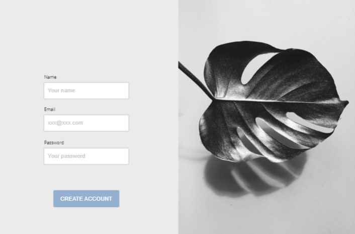
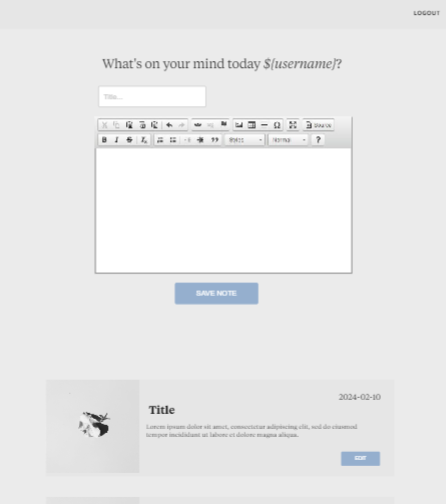
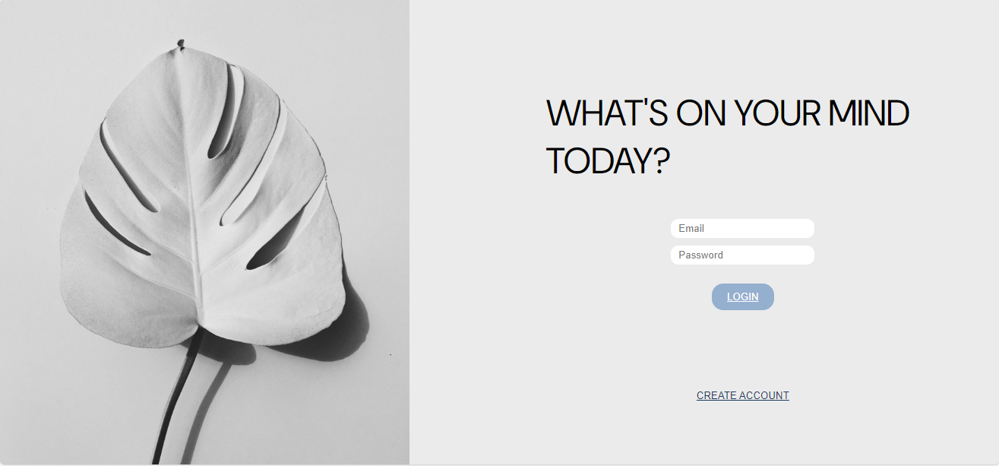
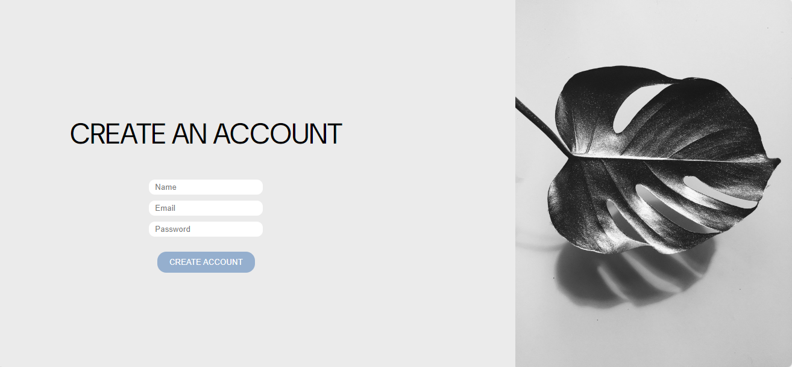
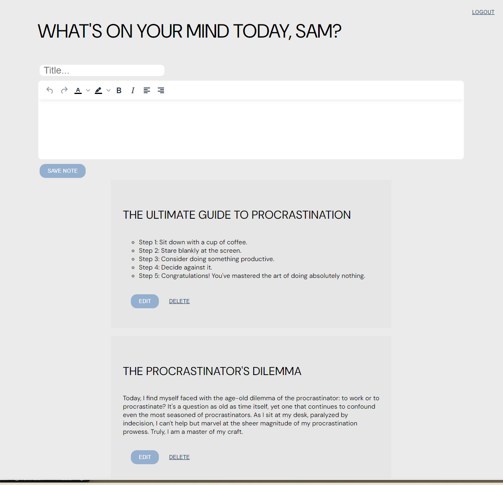

# What's on your mind?

## Demolink

https://github.com/plugga-tech/notes-alahojat

## Assignment introduction

All procrastinators unite, here's finally a assigment made just for us. I was presented with an assigment with the requirements of building a custom system for creating digital documents, or in my case, notes. Note down things to remember to do. Or things to procrastinate. It's also our first attempt at building an MySQL database and somehow making it work!

These are the technical requirements:

- Authentication: Include a login functionality.
- Document Management with MySQL Database: Documents to be created and stored in a MySQL database.
- Headless Application: The project designed as a headless application.
- WYSIWYG Editor: There should be a What You See Is What You Get (WYSIWYG) editor for document editing, allowing users to change text color, background color, and save their changes.
- Document Viewing Modes: Each document should be viewable in both editing mode and "normal" mode.
- CRUD Operations: Implementation of all CRUD operations (Create, Read, Update, Delete).
- User Management: Users should have the ability to create new accounts and only view their own documents.

## Authors

- [@alahojat](https://www.github.com/alahojat)

## Project built with


## Initial Wireframes





## Final result





## Project directory

```
cd backend
```

## Start project

```
npm install
```

## Start server

```
nodemon start
```

## MySQL passwords

```
user: notes
password: notes
database: notes
```

## Test-users in database

```
sara@mail.com
password: sara

sam@mail.com
password: sam

alex@mail.com
password: alex
```

## Dependencies

```
cors
crypto-js
dotenv
mysql2
tinymce
```
